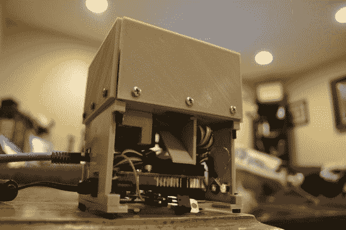

# 3D 打印分配器向你的宠物扔食物

> 原文：<https://hackaday.com/2013/07/10/3d-printed-dispenser-flings-treats-at-your-pets/>

如果你像凯文·弗林(Kevin Flynn)一样被困在虚拟世界，你仍然可以确保你的小狗因表现良好而获得奖励。只要遵循[Jwarp]为这个[互联网连接狗治疗分配器](http://imgur.com/a/C9SNn)的设计。

我们实际上对演示视频感到有点惊讶。这表明紧凑的单元能够更可靠地一次分配一种零食。它最初是一个木头原型，这使他能够在草图中布置所有 3D 部件之前调整伺服电机的工作方式。两个发动机合作完成工作。第一个允许一个零食从料斗中心离开。另一个搅拌剩余的存货，既可以放置下一次处理，又可以消除任何堵塞。

料斗的底座用作 Arduino UNO 的外壳和以太网屏蔽。一个简单的网站不断被轮询。当发现它包含分配命令时，硬件开始动作。上面的链接指向构建照片，但是在 Reddit 主题中有一些背景信息。

这将很好地配合你一直想要解决的自动送料器。

[https://www.youtube.com/embed/Xdv3ZrHuxhs?version=3&rel=1&showsearch=0&showinfo=1&iv_load_policy=1&fs=1&hl=en-US&autohide=2&wmode=transparent](https://www.youtube.com/embed/Xdv3ZrHuxhs?version=3&rel=1&showsearch=0&showinfo=1&iv_load_policy=1&fs=1&hl=en-US&autohide=2&wmode=transparent)