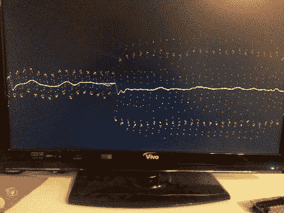

# 从 ADC 样本中滤除电源噪声

> 原文：<https://hackaday.com/2013/07/15/filtering-out-mains-hum-from-adc-samples/>

一点轻松的阅读对我们来说和对[仓鼠]来说有着不同的意义。他一直在看一本由史蒂文·w·史密斯博士写的名为《科学家和工程师数字信号处理指南》的书。作为黑客类型的人，新发现的知识的一百万种不同的用途浮现在脑海中。但是作为一个理智的检查，他决定首先关注一个有用的概念证明。他想出了一种方法[从模拟到数字转换器样本中过滤掉电源的嗡嗡声](http://hamsterworks.co.nz/mediawiki/index.php/Mains_hum_filter)。

[电源嗡嗡声](http://en.wikipedia.org/wiki/Mains_hum)就在我们身边；由运行我们现代生活的电网中的交流电产生。这是一种很有问题的干扰，这也是为什么我们经常看到 [EMF 传感器投射](http://hackaday.com/2010/12/31/arduino-emf-sensor/)的原因。现在，您可以从从 ADC 获取读数的项目中滤除环境干扰。这对于测量微小信号的应用非常有用，比如[心电图黑客](http://hackaday.com/2011/08/03/diy-propeller-based-ecg/)。

[仓鼠]很好地向外行展示了他的演示。他甚至提供了 Arduino 或 FPGA 项目的例子。