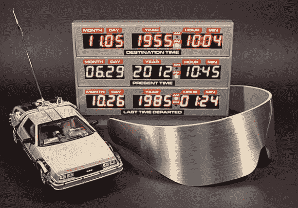

# 阿达果建造了回到未来的时间电路显示器

> 原文：<https://hackaday.com/2013/07/13/adafruit-builds-the-back-to-the-future-time-circuit-display/>

如果你是在 80 年代长大的，这个显示面板会立刻被认出来。这是[布朗博士]在他 88 英里/小时的德伦时间机器上安装的时间电路显示器。如果这仍然不能唤起你的记忆(或者如果你从未看过电影*回到未来*)，看看下面的蒙太奇视频。

问题是，如果你仔细看，你会发现这不是一个精确的匹配。Hackaday 的校友 Phil Burgess 为 Adafruit 编写了一份指南，向大家展示了如何构建这个版本。但是到了月展的时候电影居然作弊了。在生产中，月份通过涂在玻璃片上显示为字母字符。在这里要做到这一点，你需要大约 16 个分段模块(就像在[这个项目](http://hackaday.com/2012/09/21/wiring-up-a-lot-of-led-segment-displays/))。但是我们一点也不介意改变。怀旧的外观自成一体，即使它不是一个精确的复制品。

我们相信你现在已经明白了，这是由一个非常精确的实时时钟( [chronodot](http://hackaday.com/2009/10/27/parts-chronodot-rtc-module-ds3231/) )支持的，并由一个微小的微控制器板供电。这意味着你可以用它来满足任何计时需求。

[https://www.youtube.com/embed/TfGBWXA3HWg?version=3&rel=1&showsearch=0&showinfo=1&iv_load_policy=1&fs=1&hl=en-US&autohide=2&wmode=transparent](https://www.youtube.com/embed/TfGBWXA3HWg?version=3&rel=1&showsearch=0&showinfo=1&iv_load_policy=1&fs=1&hl=en-US&autohide=2&wmode=transparent)