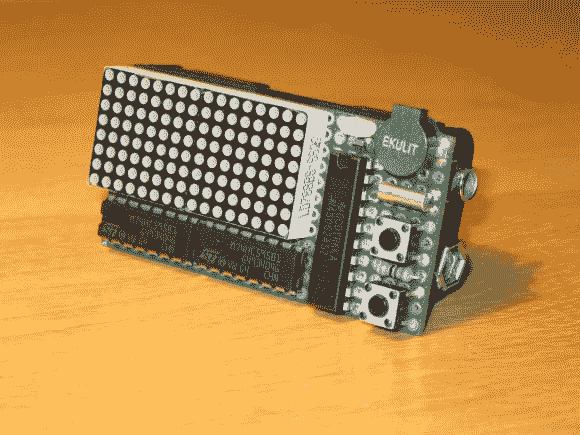

# MSP430 闹钟项目

> 原文：<https://hackaday.com/2013/07/15/msp430-alarm-clock-project/>

[Markus]把他的 LED 矩阵试验板改造成一个闹钟，每天早上叫醒他。

不要被他的组装工作有多干净所迷惑。这不是一个 fabbed PCB，这是一大块绿色原板，背面有许多点对点焊接。它由 MSP430 G2452 驱动，在此图中垂直放置。两个水平 IC 是驱动 LED 模块的 595 移位寄存器。

我们已经提到了他的装配的整洁，但是还有一个非常酷的设计元素。在该装置的背面是一个看起来像两个 AA 电池的电池座。他只使用了一个磷酸铁锂电池(3.2V)，它位于两个空腔的上部。这让他可以将支架的下半部分切成一个角度，作为时钟的支架。

不要错过带领我们浏览用户界面的视频。它拥有你所期待的闹钟。但是有一个非常亮的白色 LED 模仿日出时钟，当事情发生时，它不只是发出一个音符。

[https://www.youtube.com/embed/UG2Iyw69h-E?version=3&rel=1&showsearch=0&showinfo=1&iv_load_policy=1&fs=1&hl=en-US&autohide=2&wmode=transparent](https://www.youtube.com/embed/UG2Iyw69h-E?version=3&rel=1&showsearch=0&showinfo=1&iv_load_policy=1&fs=1&hl=en-US&autohide=2&wmode=transparent)