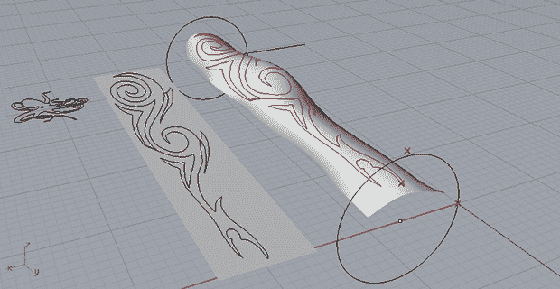

# 机器人纹身艺术家

> 原文：<https://hackaday.com/2013/07/15/a-robotic-tattoo-artist/>

这里有一些我们认为永远不会看到的东西:[一个机器人，它将计算机绘图变成用户手臂上的纹身](http://preform2perform.wordpress.com/)。

机器人的基本设计是一个框架，它可以沿两个轴直线移动，并绕第三个轴旋转。纹身设计被导入到一个 3D 建模程序中，在一些电机和微控制器的帮助下，纹身可以被机器人化地印在手臂上。

由于手臂不是一个规则的表面，[卢克]需要一种方法来校准他的前臂绘图机器人，以适应他的手臂的怪异曲线和弯曲。[这个问题的解决方案](http://preform2perform.wordpress.com/2013/06/20/arm-calibration-at-4x-speed/)是一个简单的校准过程，其中机械装置沿着[Luke]手臂的长度扫描，而“深度”伺服系统是手动调节的。这些数据被导入 Rhino 3D，机器人在给新纹身上色时会考虑手臂的曲线。

现在[卢克]只是用记号笔在他的皮肤上涂墨水，但就自动纹身机而言，这是我们见过的最好的——也是唯一的一个。