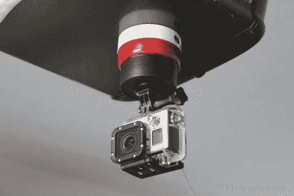

# 磁性摇摄延时相机安装再简单不过了

> 原文：<https://hackaday.com/2013/07/18/magnetic-panning-time-lapse-camera-mount-couldnt-be-easier/>

杰里米·库克(Jeremy Cook)推出了一款能够自动平移的相机支架，掀起了一股平移延时热潮。在这种情况下，他使用的是 GoPro 相机，但由于相机使用~~1/2~~1/4–20 螺栓连接，因此它可以与任何具有标准螺纹三脚架安装支架的相机配合使用。

这个装置的底座是一个鸡蛋计时器，他花了大约 8 美元买的。它有磁性，所以你可以把它贴在冰箱上，但也有足够的抓力把相机倒过来。上图显示它粘在他的车库门开启器外壳上。黑色部分由 PVC 盖构成。在油漆它之前(用卡车底板衬垫，所以有点紧)，他用他的车床去除侧面的平坦区域，并将其切成两半。然后，他在中心钻了一个孔，以接受相机的螺栓。盖子被超级粘在煮蛋计时器上，计时器的边上有一个窗口，这样你就可以知道你要设置它多长时间。

对于那些没有资源来制作 3D 打印鸡蛋计时器底座的人来说，这是一个简单的选择。车床步骤是不必要的，但因为[杰里米]有一个他使用它。它确实使最终产品看起来更好。

[https://www.youtube.com/embed/dWTBHom_9XQ?version=3&rel=1&showsearch=0&showinfo=1&iv_load_policy=1&fs=1&hl=en-US&autohide=2&wmode=transparent](https://www.youtube.com/embed/dWTBHom_9XQ?version=3&rel=1&showsearch=0&showinfo=1&iv_load_policy=1&fs=1&hl=en-US&autohide=2&wmode=transparent)