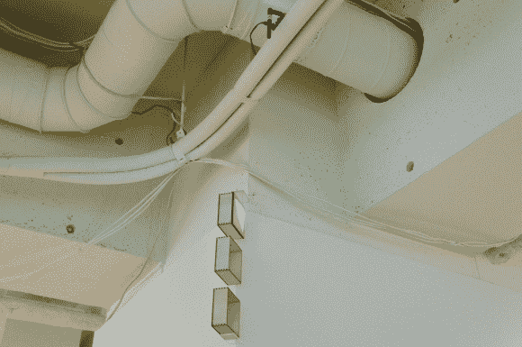

# 无线厕所占用传感器

> 原文：<https://hackaday.com/2013/07/18/wireless-toilet-occupancy-sensor/>

如果有人就在浴室门外等着，对相关各方来说都有点尴尬。这个系统通过[让下一个用户知道厕所何时可用](http://www.freaklabs.org/index.php/Blog/Misc/Loftworks-Womens-Toilet-Sensor-Project.html)来帮助缓解这个问题。[Akiba]一直在与东京设计公司 Loftworks 的人合作，让上面看到的状态信标启动并运行。

工作人员大多是女性，每三层只有一个单间女厕所。上面的方框代表三个隔间，用彩色的灯来指示卫生间是否可用或正在使用。检测基于每个隔间中的 PIR 运动传感器。它们通过无线方式与显示单元进行通信，这在最初是一个相当大的问题。浴室的门是钢制的，当关闭时，它们有效地阻止了交流。系统中使用的 900 MHz 无线电基于 802.15.4 协议。但是可以通过移动电阻以几种不同的方式进行设置。每一个都是为更快的数据吞吐量而配置的，但这并不是真正必要的。通过更改为较慢的配置，[Akiba]能够修复通信问题。

我们记得不久前在一个链接帖子中看到过[类似的浴室指示器。](http://hackaday.com/2009/11/22/hackaday-links-sunday-november-22-2009/)