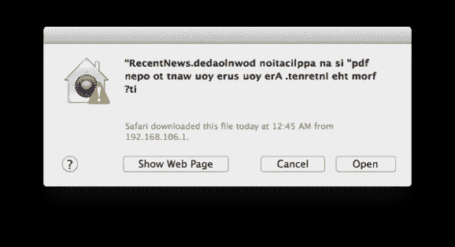

# Mac 恶意软件利用从右到左的字符漏洞

> 原文：<https://hackaday.com/2013/07/22/mac-malware-uses-right-to-left-character-exploit/>

看看这个混乱的确认窗口。乍一看，这封邮件似乎包含一堆胡言乱语，但如果你从右边开始，向左读每个字符，它实际上是可以被阅读的。文本显示如下，因为它以特殊的从右到左覆盖 Unicode 字符为前缀。这项技术在恶意软件中被用来掩盖正在启动的文件的实际扩展名。请注意，当向后写时，您的眼睛仍然可以挑出字符串“pdf ”,这可能足以欺骗门外汉批准启动该文件。

当点击一周前在野外发现的一个恶意软件时，这个确认屏幕就会启动。如果你选择运行它，为了不引起怀疑，会打开一个假的 PDF 文件。但与此同时，这个用苹果开发者 ID 签名的程序将自己安装在主目录中，并在每次启动时创建一个 cron 任务。鬼鬼祟祟！