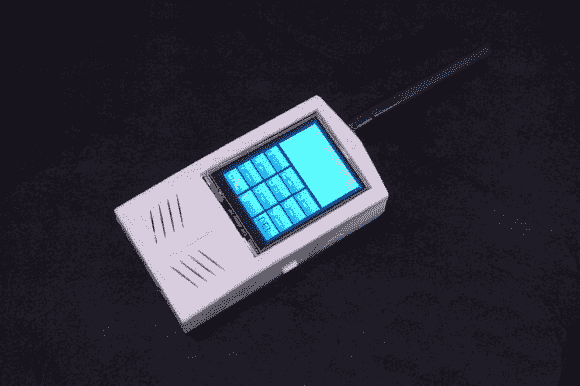

# Arduino 手机

> 原文：<https://hackaday.com/2013/07/20/arduino-cellphone/>

事实上，你可以围绕一个 Arduino 构建一个手机，这是非常巧妙的。但是我们被这个项目吸引更多的是因为它证明了电子爱好的进步。一个普通人可以用最少的知识或背景知识来建造这个东西，而不用倾家荡产。哇哦。

当然，这不是我们遇到的第一部 DIY 手机。我们最喜欢的一个是[这个](http://hackaday.com/2012/04/25/diy-cellphone/)，它位于一个家庭蚀刻的 PCB 上。早在 9 月份，T2 甚至推出了另一款配备类似组件的 Arduino 产品。但是上面看到的这个真的把所有的东西都整合到一个包里，可以用于日常生活。这些组件包括和 Arduino Uno，Seeed Studios 的 GPRS shield，TFT 触摸屏，锂电池和充电电路，以及其他一些小玩意。所有这些都装在一个 3D 打印的盒子里。

简单的电话需要简单的用户界面，这也包括在内。主菜单有两个按钮，一个用于拨打电话，另一个用于发送短信。从那里你可以看到虚拟键盘，用于输入电话号码或编写信息。

[谢谢维克多]