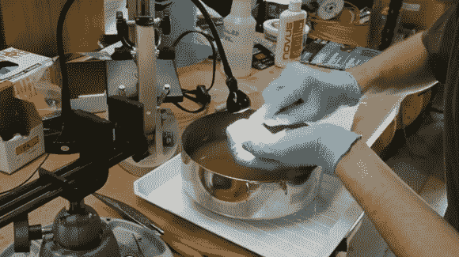

# 抛光光学元件由丙烯酸研磨而成

> 原文：<https://hackaday.com/2013/07/23/polishing-optics-milled-from-acrylic/>

[Ben Krasnow]用铸造丙烯酸磨制了一些镜片，需要一种方法在工具标记的表面上获得光学光洁度。[他测试了几种丙烯酸涂饰方法](http://benkrasnow.blogspot.com/2013/07/optical-finish-for-acrylic-vapor.html)以获得晶莹剔透的表面效果。这些测试是使用扁平块完成的。一团砂纸，由粗到细，作为手术的第一步。从那里[Ben]找到了最好的抛光步骤，从手工抛光测试、火焰抛光和二氯甲烷蒸汽抛光开始(这是类似于 3D 打印 ABS 部件的[丙酮蒸汽抛光](http://hackaday.com/2013/03/02/more-acetone-vapor-polishing-experiments/))。

火焰抛光和蒸汽抛光并不是真正精确的科学…至少在他进行的测试中是这样。很难确切知道丙烯酸树脂曝光的时间。太短或太长都会导致清晰度差。观看他的视频，看看所有的结果。我们要说的是，最简单的方法是用火焰抛光，因为它不需要你提前打磨。但是[Ben 的]测试证明，在用液体塑料抛光剂抛光之前，用 600 到 2000 粒度的砂纸手工抛光是最好的。

[https://www.youtube.com/embed/bduno3eafcc?version=3&rel=1&showsearch=0&showinfo=1&iv_load_policy=1&fs=1&hl=en-US&autohide=2&wmode=transparent](https://www.youtube.com/embed/bduno3eafcc?version=3&rel=1&showsearch=0&showinfo=1&iv_load_policy=1&fs=1&hl=en-US&autohide=2&wmode=transparent)