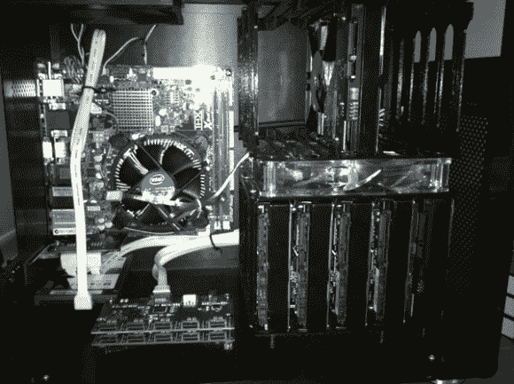

# 10 驱微服务器是电脑机箱界的小丑车

> 原文：<https://hackaday.com/2013/07/27/10-drive-microserver-is-the-clown-car-of-the-computer-case-world/>

[Coke effect]希望通过组合 10 个 3 TB 驱动器，将服务器的存储限制提升到一个更高的水平。但是他对为了方便额外的硬件而转换到更大的机箱不感兴趣。只需要一点小小的改动，就能把所有的存储空间装进一个迷你 ITX 盒子里。

他的第一步是制作他的定制驱动器安装的数字模型。这使用了两个 3D 打印的笼子，每个笼子将容纳五个垂直安装的驱动器。为了保持凉爽，两个笼子用螺栓固定在一个 140 毫米的风扇上。与主板的连接也存在一些问题。他使用双端口 SATA 卡，可以很好地配合端口倍增器。这些倍增板可以在上图的底部看到。使用另一个 3D 打印支架安装电路板。每个都将一个 SATA 端口分成五个驱动器连接。

[谢谢帕特]