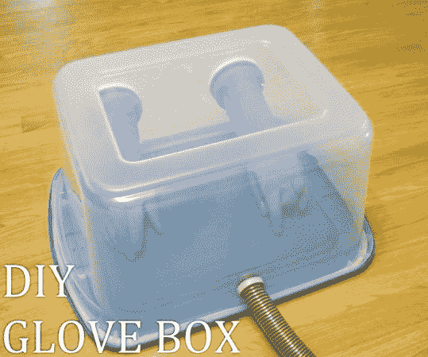

# 制作自己的排烟手套箱

> 原文：<https://hackaday.com/2013/07/27/make-your-own-fume-extracting-glove-box/>

这里有一个简单易懂的指南，教你如何制作自己的手套箱。这是一个实验室工具，包含您正在进行的项目，以保持事物的进出。例如，几年前当我们试图在硬盘上增加一个丙烯酸玻璃窗口时，我们就可以使用这个。相反，我们最终把几个小时的工作放进了一个看起来很酷的镇纸里。但是对于产生有害或危险副产品的化学实验来说，它也会派上用场。

上面的图片讲述了大部分的故事，但[杰森·波尔·史密斯]在他的视频中确实包括了几个关于建筑的好建议。他沿着透明容器的边缘使用挡风雨条来确保密封。软管用于提供负压，这样就不会有烟雾泄漏出来。我们认为，在木炭过滤器的对面增加一个小孔将有助于空气进入室内，起到排烟作用。

我们已经看到[回流焊炉](http://hackaday.com/2013/05/29/reflow-soldering-improved-with-carbon-dioxide/)的类似设置。也许这是保护你免受 3D 打印烟雾的完美解决方案。我们确信你看到了关于 [3D 打印和吸烟](http://gizmodo.com/3d-printing-indoors-is-as-bad-for-you-as-smoking-a-ciga-894193776)一样糟糕的头条新闻。

[https://www.youtube.com/embed/oGDUNB3w1aU?version=3&rel=1&showsearch=0&showinfo=1&iv_load_policy=1&fs=1&hl=en-US&autohide=2&wmode=transparent](https://www.youtube.com/embed/oGDUNB3w1aU?version=3&rel=1&showsearch=0&showinfo=1&iv_load_policy=1&fs=1&hl=en-US&autohide=2&wmode=transparent)