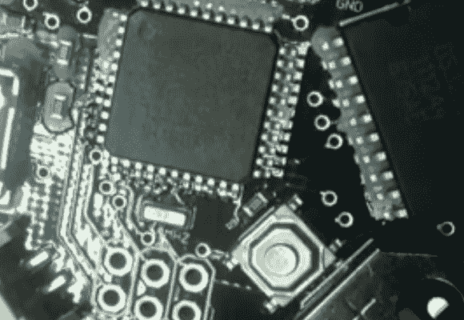

# 电锅回流焊接指南

> 原文：<https://hackaday.com/2013/07/28/electric-skillet-reflow-soldering-guide/>

众所周知，我们奇怪地被显示回流过程中焊膏的宏观视频所吸引。[这份电锅回流指南](http://www.instructables.com/id/Simple-Skillet-Surface-mount-Soldering/)提供了我们期待已久的解决方案，同时也为新手和老手提供了一些有用的提示。不确定我们在说什么？看这张图片顶部的灰色浆糊。当它变热时，它被画在每个组件的下面，如图的下半部分所示。

这个特别的指南是针对一次性组装的，所以不使用锡膏模板(我们在这个月早些时候学了很多关于那些的[)。取而代之的是](http://hackaday.com/2013/07/02/the-definitive-guide-to-solder-stencils/)[煞费苦心的牙签应用技术](http://hackaday.com/2013/02/01/populate-smd-boads-using-a-toothpick-and-tweezers/)。这需要时间，但好处是一旦你掌握了窍门，你每次都会使用完美的焊料量。在放置好所有的元件后，小心地将电路板转移到一个电锅上，盖上玻璃盖(这样他就能看到发生了什么)，并将温度设置在焊料的指定熔点以上。

因为煎锅便宜又容易找到，你真的只需要订购焊膏就可以进入这种类型的装配。我们唯一的抱怨是，你不能真正遵循这个钻机的温度分布。为此，你需要升级到一些 [PID 控制的硬件](http://hackaday.com/2011/11/24/toaster-oven-reflow-control-without-modifying-the-oven/)。

[https://www.youtube.com/embed/ToX7aISFjsg?version=3&rel=1&showsearch=0&showinfo=1&iv_load_policy=1&fs=1&hl=en-US&autohide=2&wmode=transparent](https://www.youtube.com/embed/ToX7aISFjsg?version=3&rel=1&showsearch=0&showinfo=1&iv_load_policy=1&fs=1&hl=en-US&autohide=2&wmode=transparent)