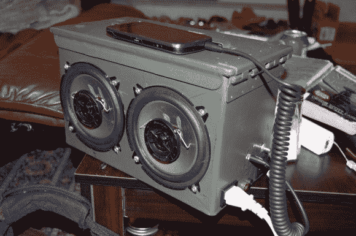

# 我把我的曲子放在弹药罐里

> 原文：<https://hackaday.com/2013/07/27/i-keep-my-tunes-in-an-ammo-can/>

称之为音箱至少有点讽刺意味。代替烈性炸药，它现在在新的生命中携带高分贝，成为一个独立的声音系统。

尽管有显眼的电源线，但窥视一下内部会发现一块足够大的电池，可以让音乐连续播放几个小时。自从他女朋友的爸爸给了他二手的扬声器和扩音器后，他就降低了建造成本。电池额定功率为 7.2 Ah 时，放大器输出功率约为 25 瓦。他添加了一个充电器，并将控制装置安装在弹药箱的侧面，这样就可以在不拆卸的情况下充电。唯一的外部组件是连接音乐源的音频插孔。

Reddit 帖子中建议的改进之一是在外壳内部添加挡板，这样来自两个立体声通道的声音就不会相互干扰。