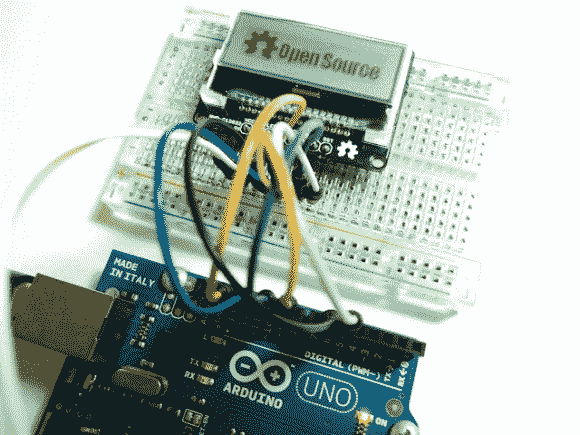

# 适用于 11 美元小间距 LCD 模块的分线板

> 原文：<https://hackaday.com/2013/07/30/breakout-board-for-11-lcd-module-with-strange-pitch/>

[Ibrahim]选择这个小 LCD 模块是因为它的价格和分辨率。在单个单元中，你可以只花 11 美元买到一个 128×32 像素的显示器。唯一的问题是引脚太小，无法用于试验板。他很快为它做了一个分线板，里面有一些额外的东西。

首先，我们喜欢电路板没有给零件轮廓增加太多内容。它增加了一个低压差稳压器和一个电平转换器。LCD 输入电压的上限为 3.3V，这些增加的器件使得使用 5V 硬件驱动该设备成为可能，如上图所示的 Arduino Uno。当他添加零件时，他加入了一个 MOSFET 来开关背光。这样，他也可以使用 PWM 进行调光。

在寻找液晶显示屏时，我们通常会去易贝。对 NHD-C12832 零件号的搜索没有找到它。我们第一次试用了 [FindChips](http://www.findchips.com/avail?part=NHD-C12832) (由刚刚收购了 Hackaday 的 Supply Frame 拥有)，它的工作效果和 [Octopart](http://octopart.com/partsearch#search/requestData&q=NHD-C12832) 一样好，后者我们更熟悉，因为[我们在](http://hackaday.com/2012/07/06/data-mining-and-saving-money-with-octoparts-historical-pricing/)之前就已经看到了该网站的一些黑客攻击。