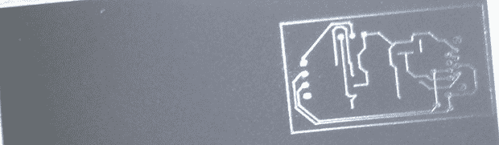

# 带粉末涂层的印刷电路板

> 原文：<https://hackaday.com/2013/07/29/pcbs-with-powder-coat/>

印刷电路板生产的调色剂转移方法应该是每个制造商的锦囊妙计。也就是说，这不是一个理想的解决方案，因为很多事情都可能出错，毁掉几个小时的工作。[Ryan]认为他有一个更好的解决方案，仍然使用热激活碳粉，但是用粉末涂料枪和激光雕刻机代替激光打印机。

[Ryan]正在使用他从亚马逊花了大约 100 美元买的粉末涂料枪。其背后的理论很简单:从枪中出来的碳粉颗粒带有静电，并结合到接地的覆铜板上。在真正的粉末涂料商店里，这种涂料被烘烤，产生一种非常坚硬的、像镜子一样的表面。[Ryan]跳过了烘烤步骤，而是通过粉末涂层板进入激光雕刻机，在那里 PCB 设计被熔化到铜上。在那之后，把板子洗掉，蚀刻掉，然后就大功告成了。

这种 PCB 生产方法真正有趣的是，它不需要非常高功率的激光。[Ryan]实际上是他的激光雕刻机的碳粉燃烧有问题，所以也许可以用高功率手持激光器，甚至蓝光激光二极管来制作 PCB。