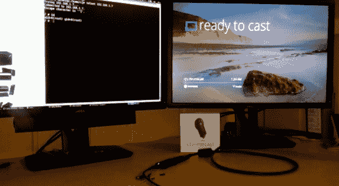

# Chromecast 引导程序漏洞

> 原文：<https://hackaday.com/2013/07/29/chromecast-bootloader-exploit-it-runs-android/>

那没花多长时间。GTVHacker 的团队已经在 Chromecast 上施展了魔法。谷歌上周宣布的 HDMI 加密狗非常受欢迎，他们不得不取消了 3 个月的免费网飞津贴。我们认为这个东西没有它也值 35 美元，特别是如果我们最终看到了一些来自社区的很棒的黑客。

到目前为止，这只是让你的脚在设备上生根发芽。除了浏览漏洞之外，[维基指令](http://wiki.gtvhacker.com/index.php/Google_Chromecast)给了我们比我们在[昨天的链接帖子](http://hackaday.com/2013/07/28/hackaday-links-sunday-july-28th-2013/)中看到的更多的内部图片。PCB 上有一个未安装的焊盘，有 17 个连接。您可以这样接入串行连接，以 115200 8n1 的速度运行。但是，您不会有开箱即用的终端访问。该漏洞利用引导加载程序中的漏洞来刷新被黑客攻击的系统文件夹，从而提供 root 用户。擦除缓存后，它会正常重启，但现在您可以在端口 23 上访问根 shell。

[https://www.youtube.com/embed/gW38nEleiBM?version=3&rel=1&showsearch=0&showinfo=1&iv_load_policy=1&fs=1&hl=en-US&autohide=2&wmode=transparent](https://www.youtube.com/embed/gW38nEleiBM?version=3&rel=1&showsearch=0&showinfo=1&iv_load_policy=1&fs=1&hl=en-US&autohide=2&wmode=transparent)