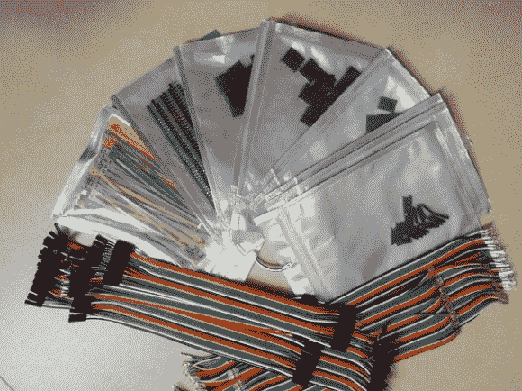

# 任何尺寸的 SIL 连接器套件

> 原文：<https://hackaday.com/2013/07/30/any-size-sil-connector-kit/>

与寻找连接几个元件的连接器相比，蚀刻和组装电路板是小菜一碟。但是 Hackaday 的校友(Ian Lesnet)和他的团队在危险原型方面提出了一个解决方案，这让我们想知道为什么我们没有在很久以前看到这一点？他们正在准备任何尺寸的带状电缆套件。

假设您找到了想要的连接器类型。您需要将带状电缆切割到一定长度，压接连接器，然后将这些连接器安装在外壳中。我们已经这样做过很多次了，作为吝啬鬼，我们用尖嘴钳而不是买一个合适的压接钳。这种解决方案消除了繁重的工作。该套件将运送几种不同长度的带状线，连接器已经由机器放置。这样你就可以去掉你需要的连接器数量，选择合适的房子尺寸，然后把它安装到位。套件中还有几种长度的公、母和公/母跳线电缆，您可以用同样的方式剥离。

现在我们该如何处理放在车间里的那卷带状电缆呢？