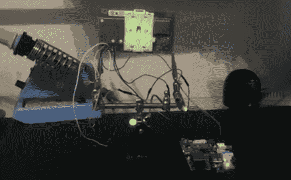

# Xbox 360 Light Right 和 RF 模块连接到 Raspberry Pi

> 原文：<https://hackaday.com/2013/07/30/xbox-360-light-right-and-rf-module-connected-to-raspberry-pi/>

如果你想在电脑上摆弄你的 Xbox 360 控制器，微软很乐意卖给你一个 USB 加密狗。但是[蒂诺]走了一条不同的路。驱动 Xbox 360 状态灯环的电路板还包括无线连接控制器的 RF 模块。他用 GPIO 头将这个连接到他的树莓 Pi 。

该模块通过内部电缆连接，Xbox 主板将其视为 USB 设备。问题是，它实际上不能处理 USB 连接器上的 5V 轨；它想要 3.3V。但这对于 RPi 的引脚接头来说不成问题。一旦完成了一些连接，灯光就可以通过 ~~SPI~~ 来控制，I2C 和【蒂诺】在 Github 上发布了一些与射频模块一起工作的示例代码。他计划发布后续文章，将该模块与简单的微控制器而不是 RPi 板进行接口。如果你等不及了，我们相信你可以通过研究他的示例代码找到你需要的细节。