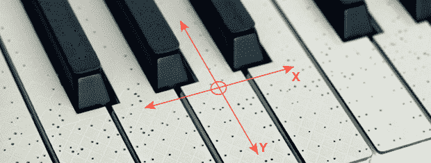

# 触摸控制键盘上的每个键

> 原文：<https://hackaday.com/2013/07/30/touch-control-for-every-key-on-the-keyboard/>

在所有的乐器中，键盘在改变单个音符的音高和音色方面是最差的。在熟练的演奏者手中，管乐器和弦乐器可以很容易地做到这一点，但在一些电子键盘的滚轮和操纵杆控制之外，拨动钢琴意味着你唯一能真正改变的事情就是音量。

TouchKeys [想要结束这种键盘乐器严重缺乏力度](http://www.kickstarter.com/projects/instrumentslab/touchkeys-multi-touch-musical-keyboard)的状况。基本上，它将键盘上的每个键都变成了多点触摸传感器，允许任何键盘手只需在键上移动手指，就可以改变音高、滤波器、音色或乐器的任何其他参数。

TouchKeys 的工作原理是用电路板覆盖键盘上的所有按键，电路板插入隐藏在机罩下的模块中。这些板布满电容感应点，允许计算机识别玩家触摸每个键的位置，并独立修改每个键的过滤器或音量。

TouchKeys Kickstarter 正在提供一个工具包，为 25 键键盘配备这些传感器，价格约为 550 美元。价格不菲，但希望我们将来能在真正的生产键盘上看到这项技术。