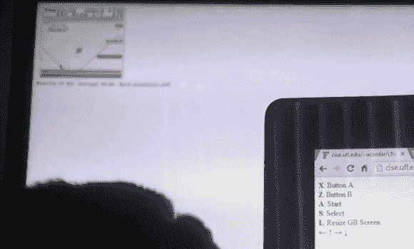

# 如何在 Chromecast 上玩 Game Boy 模拟器

> 原文：<https://hackaday.com/2013/07/31/how-to-play-a-game-boy-emulator-on-chromecast/>

它很小，很模糊，但是很有效。这里有一个在 Chromecast 上玩模拟器的概念证明，它以最初的 Game Boy 为例。

请注意，演示中显示了两个屏幕。背景中的焦点之外是显示游戏的 Chromecast 电视。前景是一台计算机，打开了一个列出控制设置的浏览器。这些是 Xbox 360 控制器的按钮映射。模拟器[是一个 JavaScript Game Boy 模拟器](http://codebase.es/jsgb/)。这是通过一个简单的 html 文件加载到 Chromecast 上的(在 repo 中称为 receiver)。发送方(也是一个简单的 html 文件)在计算机上加载另一个 JavaScript 包，该包将控制器的按键转换为键盘输入，并将它们发送给接收方。

这让我们对模拟器黑客们刮目相看。我们很乐意看到这归结为智能手机和 Chromecast 作为两个硬件，触摸屏作为游戏输入。

[https://www.youtube.com/embed/yKJ8iX45cGY?version=3&rel=1&showsearch=0&showinfo=1&iv_load_policy=1&fs=1&hl=en-US&autohide=2&wmode=transparent](https://www.youtube.com/embed/yKJ8iX45cGY?version=3&rel=1&showsearch=0&showinfo=1&iv_load_policy=1&fs=1&hl=en-US&autohide=2&wmode=transparent)

[via [Reddit](http://www.reddit.com/r/Chromecast/comments/1jcz7l/gameboy_emulator_on_chromecast_now_with_gamepad/)