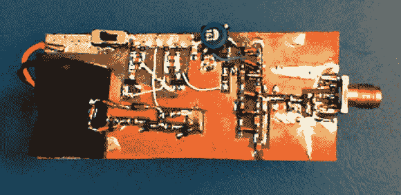

# 雪崩脉冲发生器设计

> 原文：<https://hackaday.com/2013/08/06/avalanche-pulse-generator-design/>

这雪崩脉冲发生器是一个伟大的方式来测试你作为一个电子工程师的气质。挑战在于[真正理解设计的每个部分是如何工作的](http://dangerousprototypes.com/2013/07/20/avalanche-pulse-generator-and-some-scope-porn/)。一个多星期前，当我们第一次学习这些图表时，我们确实得到了不及格的分数。但是我们慢慢开始理解在引擎盖下发生了什么。

雪崩晶体管的概念是来自模拟领域的邪恶巫术，它利用晶体管的击穿电压来实现可预测的结果。用外行人的话来说，它(它)使用晶体管来产生一个真正快速的脉冲。上面链接的文章参考了以前的几个雪崩脉冲发生器设计，但这一个有点不同，它使用多谐振荡器电路从一对 AAA 电池产生约 50V 的电压。

即使你不知道这里发生了什么，你可能会对最后几段感兴趣，其中电路是使用尖端的 Teledyne LeCroy wave master 820 zi-a 测量的。这是一个带 15.3 英寸屏幕的 20 GHz 示波器，你永远不会拥有它。