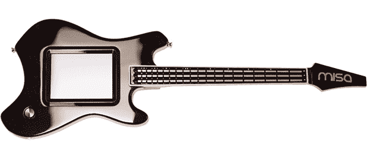

# 用 Kaoss Pad 和 Ribbon 控制器制作真正的乐器

> 原文：<https://hackaday.com/2013/08/01/making-a-real-instrument-out-of-a-kaoss-pad-and-ribbon-controllers/>

MIDI 吉他自 80 年代就已经出现，几乎无一例外，它们被设计成原声吉他和电吉他的直接、一对一的复制品。[迈克尔]一直致力于用米砂三低音吉他颠覆这种传统，这是一种 MIDI 吉他，旨在成为完美的吉他形状的合成器接口。

三低音本身不发声；相反，它是一个复音 MIDI 控制器，有三个通道，由琴颈上的三个带状控制器控制。机身包含一个巨大的触摸屏，分为四个 MIDI 通道，本质上是将吉他变成一种专为电子音乐设计的乐器，而不是一种组装成电子角色的声学乐器。

与许多其他数字吉他形状的 MIDI 控制器不同，tri-bass 实际上是由木头制成的。是的，脖子是由枫木制成的(当然，镶嵌着三个丝带控制器)，身体直接来自一棵树，造型灵感来自[一个被遗忘的复古现代设计](http://en.wikipedia.org/wiki/Fender_Swinger)。这是一个令人印象深刻的套件，我们迫不及待地想看到[迈克尔]的作品在世界各地的数字吉他手手中。

你可以看看下面迈克尔摇滚的视频。

[https://www.youtube.com/embed/rKJeT5wYoME?version=3&rel=1&showsearch=0&showinfo=1&iv_load_policy=1&fs=1&hl=en-US&autohide=2&wmode=transparent](https://www.youtube.com/embed/rKJeT5wYoME?version=3&rel=1&showsearch=0&showinfo=1&iv_load_policy=1&fs=1&hl=en-US&autohide=2&wmode=transparent)