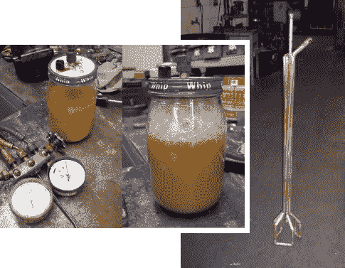

# 生物柴油设备黑客

> 原文：<https://hackaday.com/2013/08/03/biodiesel-equipment-hacks/>

几年前，他为一些朋友承担了一个生物柴油项目。一个完全可操作的处理设备从未实现，但他确实记录了他在项目期间想到的一些成功的方法。

这个想法是从餐馆回收废油，在你改装的赛车或其他交通工具中燃烧。这听起来很容易，但你见过培根脂肪冷却后会发生什么吗？当然，我们谈论的是来自植物来源的油，但同样类型的凝结也会出现。在冬天，通过加工设备泵送它变得特别困难，这就是为什么[奥德曼]想出了右边的加热泵头。它有三个连接:两个是铜管回路的一部分，允许 150 度的水循环以液化油脂。第三个连接吸取熔化的油。你还需要调节燃料的含水量。沙拉酱罐的插图是他利用真空使燃料脱水的试验。他了解到需要稍微加热以减少起泡。他曾计划扩大这个概念的规模，将真空应用于储存在丙烷罐中的燃料。