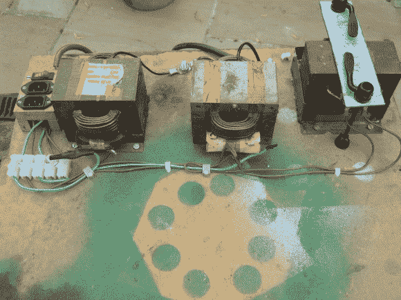

# 用于 MOT 焊机的限流器

> 原文：<https://hackaday.com/2013/08/03/current-limiter-for-a-mot-welder/>

[Mike Worth]希望能够在低于全功率的情况下运行他的微波炉变压器焊接设备。在受到我们介绍的一些其他 MOT hacks 的启发后，他认为肯定有很多方法可以做到这一点。但是他在这个话题上的搜索没有任何结果。所以他只是为焊机设计并制造了[自己的可调限流器。](http://www.mike-worth.com/2013/07/31/adding-a-current-limiter-to-my-mot-welder/)

在他文章的开始，他详述了我们称之为焊工自举程序的内容。回过头来看看[他最初的构建帖子](http://www.mike-worth.com/2012/04/18/building-an-arc-welder-from-microwave-oven-transformers/)看到他一直在用夹子把内核的框架固定在一起。为了使设置更加稳健，他需要焊接它们，但这是他唯一可以使用的焊机。所以他在线圈上贴了些木头屏蔽，然后点燃了它。

限流器本身是由第三个 MOT 构建的。通过更换 E 形件和 I 形件来调整型芯。这允许在不改变绕组的情况下限制电流。[Mike]用几个自行车轮快速连接叉把它固定住。

这只是表明，你永远不应该不拉变压器就扔掉微波炉。即使你不需要电焊工，难道你不喜欢高压灭虫器吗？