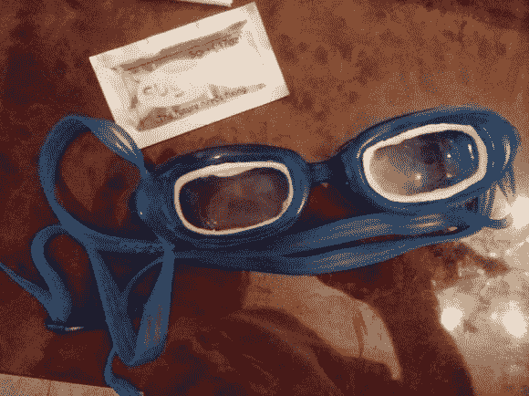

# DIY 处方泳镜

> 原文：<https://hackaday.com/2013/08/04/diy-prescription-swimming-goggles/>

不戴眼镜我们看不到太多东西(这也是为什么我们洗澡时刮胡子的习惯往往结局很糟糕)。我们的眼镜很贵，但是我们醒着的时候都戴着，所以很值。但直到最近，我们才崩溃，开始购买处方太阳镜。然而，当涉及到体育运动时，我们不会为专门的规格投入资金。这里有一个方法可以改变这种情况。如果你手头上还有最后一副眼镜，那就改装一下泳镜的镜片吧。

在这种情况下,[ Dashlb 的镜片已经小到可以装进护目镜。他只是在边缘加了一颗糖珠来固定镜片。但是，如果你确实需要将它们切割成合适的尺寸，将镜片与你的眼睛对齐是很重要的，所以我们建议如下:让一个伙伴站在你面前，在眼镜和护目镜上标记你瞳孔的中心。如果你需要切割镜片(可能是一种聚碳酸酯)，在切割之前确保标记匹配即可。

我们可以尝试用一些环绕式太阳镜来制作一副便宜的处方自行车太阳镜。