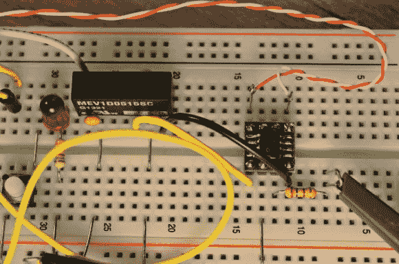

# 高分辨率测量微小电流

> 原文：<https://hackaday.com/2013/08/04/measuring-tiny-current-with-high-resolution/>

[Paul]知道他可以得到一台示波器，以他所追求的分辨率来测量微安信号，但这将花费他一大笔钱。但他对高端设备的工作原理有所了解，因此[他构建了这个电路，为自己的实验设备](http://www.dorkbotpdx.org/blog/paul/measuring_microamps_milliamps_at_3_mhz_bandwidth)提供精确数据。

他试图想象微控制器在不同操作点的电流消耗情况。他认为 5ma(2.5mV)是他所研究的大致范围。这么小的测量值有噪声问题。解决方案是绿色分线板上的芯片。它的价格并不完全适合移动，单个数量的成本约为 20 美元。但是，当与优质电源搭配时，它就能完成任务。AD8428 是一款超低噪声放大器，其精度远远超过他所需，输出带宽为 3.5 MHz。现在成本似乎是值得的。

[Paul 的]帖子里的示波器截图真的让人印象深刻。通过在微控制器的电源线上并联两个 1 欧姆的电阻，他能够在慢启动模式下监控芯片。它从 120 微安开始，该图捕捉到振荡器开始运行的时间点以及系统时钟与之相连的时间点。