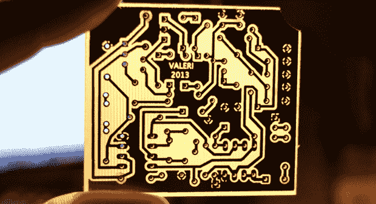

# 用相机和数学钻 PCB

> 原文：<https://hackaday.com/2013/08/04/drilling-pcbs-with-cameras-and-math/>

制作完第一块 PCB 后，你马上面临下一个挑战——钻孔。这是一个可以用小型钻床完成的任务，但是很多制造商已经有了一个小型数控铣床或雕刻机，但是如何第一次就让它工作呢？[【Alessio】你是否已经用一种技术覆盖了](http://www.alessiovaleri.it/using-transform-matrix-for-pcb-drilling-part-2/)，这种技术在第一次和每次都使用 CNC 安装的网络摄像头和一些线性代数来实现完美的通孔。

几个月前，我们看到[Alessio]的[使用转换矩阵和 PCB 钻孔](http://hackaday.com/2013/01/11/letting-euler-help-out-with-pcb-fabrication/)。这项技术背后的原因是，如果 PCB 没有与 CNC 轧机的轴线精确对齐，或者如果墨粉转移板的缩放有点偏离，自动化钻孔过程只会以痛苦告终，孔会穿过痕迹和一系列其他讨厌的事情。线性代数的应用解决了这个问题——从两三个已知的位置进行测量，很容易对数控机床进行编程，以准确地在应该的位置钻孔。

[Alessio]的新项目采用了相同的数学技术，并将它们应用到一个非常时尚的应用程序中，该应用程序使用了一个安装在钻架上的网络摄像头。将自制的印刷电路板安装到工厂后，[阿莱西奥]只需标出几个已知点，输入钻孔文件，然后让计算机计算在哪里钻孔。结果是显著的——使用阻焊和丝网印刷设备，这些手工制作的电路板可以和专业制造的电路板一样好，

在他的页面上有[阿莱西奥]工具的 Windows 和 OS X 二进制文件，下面有一个视频演示。

[https://www.youtube.com/embed/tzI445XsPDs?version=3&rel=1&showsearch=0&showinfo=1&iv_load_policy=1&fs=1&hl=en-US&autohide=2&wmode=transparent](https://www.youtube.com/embed/tzI445XsPDs?version=3&rel=1&showsearch=0&showinfo=1&iv_load_policy=1&fs=1&hl=en-US&autohide=2&wmode=transparent)