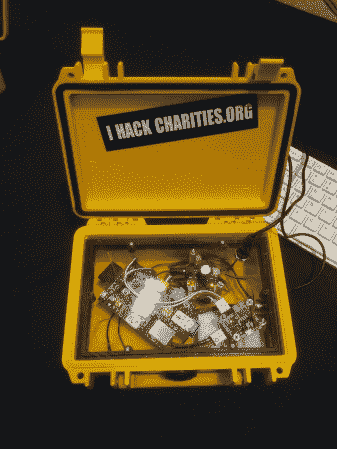
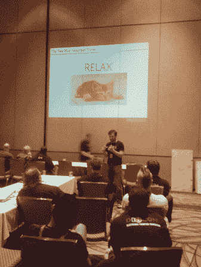

# DEF CON:黑客攻击慈善机构和路由器

> 原文：<https://hackaday.com/2013/08/05/def-con-hacking-charities-and-routers/>

Where’s Cardboard Snowden?

在 DEF CON 的最后一天，我和一些慈善黑客交谈，查看了开锁村，了解到我的路由器在无线村有多不安全。

## 黑客慈善组织

[黑客慈善组织](http://www.hackersforcharity.org/ "Hackers for Charity")帮助慈善机构和黑客志愿者提供他们通常负担不起的服务。他们充当一种牵线搭桥的程序，将有特殊技能的人与有需要的慈善机构联系起来。它也为黑客类型提供了磨练技能和建立简历的机会。你可以在这里了解如何注册成为志愿者、慈善机构或捐赠者[。](http://volunteer.hackersforcharity.org/)

黑客慈善组织给我看了他的项目:盒子里的学校。这是一个鹈鹕案件塞满了树莓 Pi，脂电池，太阳能充电控制器，和电源模式控制器。RPi 有一个 WiFi 卡，作为接入点运行，允许学生连接。然后，它提供大量的内容，这些内容通常在互联网连接有限的地区是无法获得的。这包括可汗学院的视频，古腾堡计划的书籍，维基百科的子集，等等。这个项目将在接下来的几个月内投入使用。

The School in a Box provides learning resources in remote areas.

## 开锁村

开锁村今年非常热闹，开锁人的开放式组织每小时都在进行培训，并提供开锁练习。TOOOL 在他们的网站上发布了他们在[村的幻灯片，如果你有兴趣学习开锁的基础知识，它们是一个很好的资源。](http://toool.us/resources.html "TOOOL Resources")

TOOOL teaches important lockpicking tips: relax, and kittens.

## 无线村

无线村是无线五项的发源地。这场比赛让参与者通过各种 WiFi 挑战。有一个范围挑战，WPA 破解挑战，最后是一些对 WiFi 网络的一般性攻击。

这个村子有自己的一套关于各种无线话题的讲座。其中一个让我印象深刻的是 ISE 的《小型办公室/家庭办公室(SOHO)网络设备中的漏洞》。演讲表明，几乎所有消费级 WiFi 路由器都存在跨站点请求伪造、目录遍历、命令注入和缓冲区溢出漏洞，包括我家里的一个(不，我不会告诉你是哪一个)。演讲回顾了用[Nm](http://nmap.org/ "Nmap")AP 扫描端口，用 netcat 识别服务，以及构建漏洞的过程。关于 TP-Link 路由器的一个漏洞的解释可以在[这里](http://securityevaluators.com/content/case-studies/routers/tp-link_wr1043n.jsp "TP-Link Exploit")找到。

## 再见 DEF CON

闭幕式标志着会议的结束。组织者宣布，这场骗局已经为电子前沿基金会筹集了近 10 万美元，人们欢欣鼓舞。

骗局是一个伟大的时刻，我想感谢所有的发言者，打手，和人类，使过去几天的爆炸。我们将继续关注这场骗局的一些故事，并希望在未来提供更多的骗局报道。