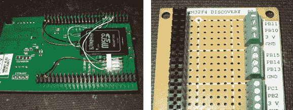

# 驯服 STM32 探索板，供常规使用

> 原文：<https://hackaday.com/2013/08/07/taming-stm32-discovery-boards-for-regular-use/>

我们认为[Karl Lunt]说的有道理，他说 STM32 发现板很酷，也不贵，但不是爱好友好型的。但也没什么大一点的创意解决不了的。上图是他用来驯服探索板的三个黑客。

首先是增加了一个 microSD 卡适配器。他将绕线焊接到适配器的每个触点上。他建议采用低铁设置，以确保不会熔化塑料适配器外壳。然后，他使用双面胶带将其粘贴到开发板的底部。导线的另一端缠绕在双排引脚接头上的相应引脚上。类似地，UART3 连接从引脚接头到白色快速连接插座断开。这让他可以访问串行数据，而不必解决困扰他的 USB 问题。

最后，他制作了自己的子板，将双排接头分解成螺丝端子。我们遇到了硬件与主板原生连接的接口问题——跳到 IDE 电缆从来都不可靠。这种分线板不仅使它变得简单，而且根据引脚的交替功能将它们组织成组。

您是否记得看到过这款 Discovery board 的钢锯版，它以一个开发板的价格提供两个开发板？