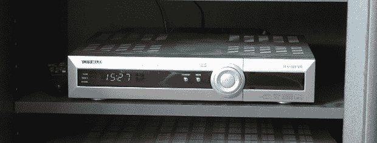

# 有线电视盒变成了网络时间显示器

> 原文：<https://hackaday.com/2013/08/07/a-cable-box-becomes-a-network-time-display/>

2011 年[Erkki]的 DVB 盒子断气了。它已经成为他的媒体中心的固定设备有一段时间了，多年来忠实地解码电缆和录制节目。不过，一个不可靠的电源会让最强大的机器瘫痪。而顶场箱最终发现自己被废弃了。[Erkki]喜欢这个有线电视盒的一点是它奇妙的绿色 LED 时钟——即使在盒子被宣布死亡后，他仍然把它当作时钟使用。不想让一台有故障的机器继续维持生命，[Erkki]决定把它的内脏取出来，换上一台联网的 Arduino，通过网络接收时间

[Erkki]最初使用 Arduino 和 ENC28J60 以太网模块从 NTP 服务器接收时间，并将其发送到 LCD 显示器上。一个完整的 Arduino 来完成这种工作，尤其是一个或多或少完整的项目，有点大材小用，所以[Erkki]设计了一个 PCB 来更好地使用他的 duino。

这个建筑有趣的一点是，有一天[Erkki]发现它完全坏了。他认为这是微控制器的问题，他首先用 9 伏电压烧坏了 ATMega，然后开始编写新芯片的程序。在用微控制器查看了他的 NTP 服务器上的不同端口后，[Erkki]意识到他最近重置了网络开关，这意味着以前的微控制器工作正常。

未来，[Erkki]希望在这个坐在大盒子里的 8×4 七段显示器上增加一些新功能；比如读取温度，检查 IRC 和他的物理邮箱，当有人在前门时通知他。