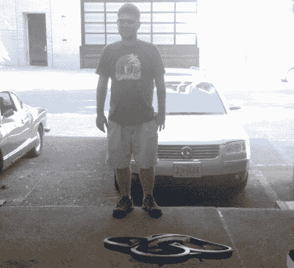

# 谷歌眼镜控制的四轴飞行器

> 原文：<https://hackaday.com/2013/08/09/google-glass-controlled-quadcopter/>

出于某种原因，这个项目让我们想起了尼尔斯蒂芬森的钻石时代的狗 Pog 网格。这并不是说有一大堆无人机在这个家伙周围漂浮，而是他有一个看起来像是他的保镖的无人机，并且由他头上戴着的谷歌眼镜控制。未来就是现在！

我们发现这个项目的变化也很有趣。它始于 Leap motion 控制的漫游车项目。前几天，我们看到了一个类似的黑客将一个跳跃动作与一个六足机器人配对。但是[布莱恩]对此并不满意。尝到了替代控制输入的滋味后，他开始着手制作谷歌眼镜的控制界面。但是移动你的头来控制一辆漫游车的问题是，你实际上看不到它，因为向下看会引起不必要的运动。他的解决方案是过渡到四轴飞行器，当他看着它时，它会悬停在眼睛的高度。Glass 正在向服务器发送原始传感器数据，服务器会翻译四轴飞行器的控制命令。

[https://www.youtube.com/embed/BSXWkidgA1Q?version=3&rel=1&showsearch=0&showinfo=1&iv_load_policy=1&fs=1&hl=en-US&autohide=2&wmode=transparent](https://www.youtube.com/embed/BSXWkidgA1Q?version=3&rel=1&showsearch=0&showinfo=1&iv_load_policy=1&fs=1&hl=en-US&autohide=2&wmode=transparent)

[谢谢莫希布]