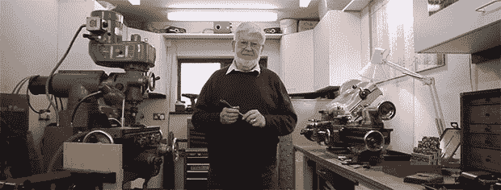

# 模型工程师

> 原文：<https://hackaday.com/2013/07/08/the-model-engineer/>

小时候，[迈克·克里斯普]看过一部电影，讲述了英国最大的窄轨机车之一。虽然这个故事非常振奋人心，但当他一走出剧院，[迈克]就对自己说，他必须拥有一辆这样的机车。胡斯在模型工程领域开始了一生的冒险。

[迈克]建立模型机车和其他蒸汽动力的原动力。从五英寸轨距的机车到小型蒸汽拖拉机，一切都可能出自他的小车间，所有这些都是用只有一生的经验才能提供的卓越的加工和工程技术制造的。

至于是什么驱使[迈克]长时间呆在他的车间里，他说他的车间只是一个地方，一个修补的地方，一个简单思考事情的地方，即使他的手没有弄脏。这是一件美妙的事情，即使[迈克]要把他的技术产品藏起来，不让世人知道。