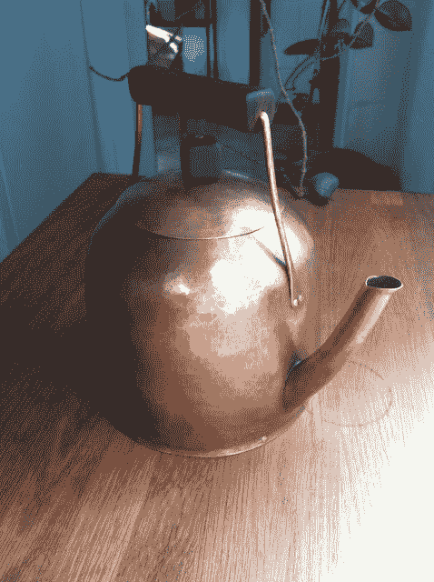

# 铜水壶，专为潮人咖啡场景打造

> 原文：<https://hackaday.com/2013/07/15/copper-kettle-just-for-the-hipster-coffee-scene/>

手工咖啡是我们需要写的一个专题。但现在我们展示的是这个铜壶，它被设计成能非常缓慢地倒出沸水，以获得一杯完美的慢滴爪哇咖啡。

[CHS]为他的朋友[Nate]做水壶。[整个过程](http://siometalworks.blogspot.com/2013/07/copper-kettle.html)从一块弧形的平铜片开始，当弯曲到两端相遇时，它会变成一个稍微呈圆锥形的圆柱体。在这个接缝上获得一个水密密封是必要的，它需要四五次尝试才能达到完美。

为了让水壶成形[CHS]用一片薄薄的铁轨临时做了一个心轴。打磨光滑后，它就在铜的里面，给了他锤打的东西。我们认为这一步很神奇……这有点像古老的雕刻格言，你移除所有不是你想要的东西。当最后的曲线被敲进作品时，作品的美就真正显现出来了。