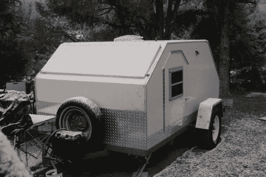

# 棱角分明的泪珠露营车包括一个临时搭建的画廊

> 原文：<https://hackaday.com/2013/07/17/angular-teardrop-camper-includes-an-improvised-galley/>

这个泪珠露营车更多的是关于角度，而不是曲线。这使得建设相当容易。但是吸引我们眼球的不仅仅是形状。这种设计经久耐用，有一些不错的便利设施，如内置音响系统和后部储物区的厨房。这个项目很老了，但是像这样一个好的黑客技术确实是永恒的。

前往 Desert Dawg 网站查看项目概述。这被证明是一个与上周的[泪滴项目完全不同的构建。拖车的框架开始了它在船上的生活。长鼻被切割，横梁被焊接到位，形成露营车的最终足迹，这对于一个大号床垫来说足够大。除了舒适的睡眠之外，当你打开后盖时，小厨房会让做饭变得轻而易举。](http://handmade.hackaday.com/teardrop-camper-combines-simplicity-style-and-function/)

[谢谢道格]