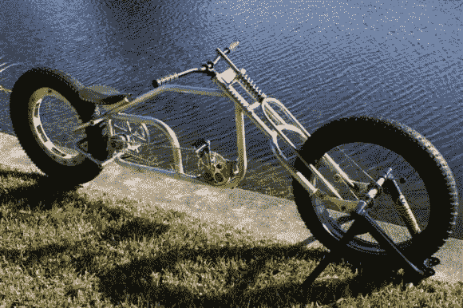

# 无毂骑士

> 原文：<https://hackaday.com/2013/08/10/the-hubless-horseman/>

在一个朋友家，所有的免费零件都被抢购一空，没有人想要废弃的轮椅轮子:包括埃里克。当然，直到他自发地决定尝试一些有点疯狂的东西，并采取了[怪异但非常富有想象力的无轮毂自行车建设。](http://bikerodnkustom4.homestead.com/hubless_horseman.html)

在把轮椅的轮缘和固定的扶手连接到自行车的轮缘上之后，[Eric]把一对滚轮安装到一个独立的金属部件上，这个金属部件实质上是一个轴承。随着生产的进展，自行车被进一步改进。更多的滚轮，一个巨大的链轮，和一堆加工过的铝片。轮胎的气门杆必须重新定位，以允许车轮自由旋转。

成品是一辆令人惊叹的自行车，[[Eric]后来又重新设计了](http://www.forum.freakbikenation.com/phpBB3/viewtopic.php?f=17&t=534)，将直排轮更新为精密车床加工的塑料(特别是 [UHMWPE](//en.wikipedia.org/wiki/Ultra-high-molecular-weight_polyethylene) )滚轮。一定要看《T4》中《无毂骑士》的视频。如果出于某种原因，你之前唯一接触过的无轮毂车轮是《星际迷航》重启版中的 *TRON* 轻型自行车或【柯克的】摩托车，那就帮自己一个忙，看看它们的发明者 [Franco Sbarro](http://sbarro.perso.neuf.fr/biogb.html) 。