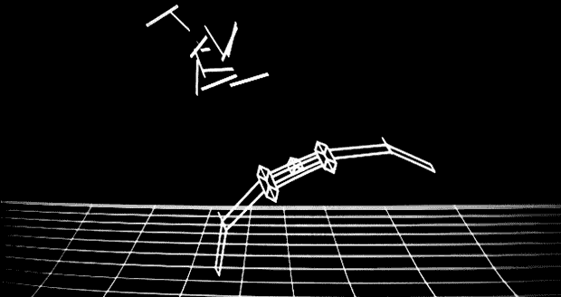

# 用 FPGA 制作矢量街机游戏

> 原文：<https://hackaday.com/2013/08/10/making-vector-arcade-games-with-an-fpga/>

虽然我们肯定大多数 Hackaday 的读者是在街机游戏中长大的，这些游戏有精灵、像素和其他闪亮的亮色方块，但情况并不总是如此。许多经典的街机游戏——特别是月球着陆器、重力星和小行星——都使用矢量显示。这些游戏的功能更像是示波器，而不是画单个像素，画直线。当[托德]和[安德鲁]从一个旧的小行星橱柜中拿到显示器时，[他们知道他们必须做什么](http://blog.narrat1ve.com/2013/08/08/vectors-or-my-man-inf-left-a-vec-and-a-9-at-my-crib/):构建他们自己的 vector 街机游戏。

这些人制作了自己的 DAC 和放大器板，可以直接插入 Nexys2 FPGA 开发板。这是在他们用粗糙的手工 R2R DAC 测试了一些 3D 绘图代码之后，他们用这个 DAC 在示波器屏幕上绘制并旋转一个立方体。

这些家伙不仅建立了一个矢量视频卡，他们还将 FPGA 的 VGA 输出连接到一个单色显示器上，用于游戏中的 HUD。令人敬畏的工作，吹走任何可在矢量街机游戏的黄金时代。这是一个美丽的工程，当然值得自己的内阁。

下面是游戏的视频。

[https://www.youtube.com/embed/lEkPHPiHuio?version=3&rel=1&showsearch=0&showinfo=1&iv_load_policy=1&fs=1&hl=en-US&autohide=2&wmode=transparent](https://www.youtube.com/embed/lEkPHPiHuio?version=3&rel=1&showsearch=0&showinfo=1&iv_load_policy=1&fs=1&hl=en-US&autohide=2&wmode=transparent)