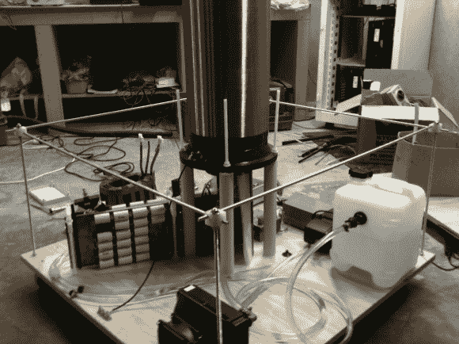

# 为特斯拉线圈制造电子设备…并用水冷却它们

> 原文：<https://hackaday.com/2013/08/11/building-the-electronics-for-a-tesla-coil-and-watercooling-them/>

几年前，一个朋友的朋友给了帕特里克一个特斯拉线圈。这个机会太好了，他不能错过。

然后，他开始创造一个[离线特斯拉线圈](http://www.pnuke.co.nz/2013/08/pyramider-evolution-from-spark-gap-to.html) (OLTC)，其中没有使用电源变压器。输入电源经过整流后直接馈入储能电容器。

[Patrick]因此不得不建造一个巨大的电容器组，更重要的是他自己的初级线圈，由 1.6 毫米(0.064 英寸)的铜片制成，以处理所涉及的巨大电流。空气冷却电子设备是足够的，直到他开始使用他的三相输入电源。由于更大的功率需要更多的热量，所以设计了一个水冷块来冷却主晶体管。

帕特里克的文章非常详细，值得一读。一旦你完成了，我们建议你浏览他的网站，那里有很多很酷的项目描述。