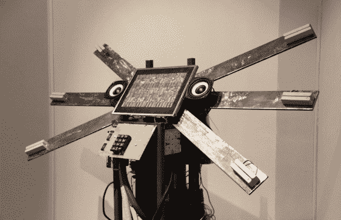

# 只要刷你的卡，输入密码…会有什么问题呢？

> 原文：<https://hackaday.com/2013/08/13/just-swipe-your-card-and-enter-the-pin-what-could-go-wrong/>

我们真的希望这个项目会让你颤抖。

“金融风险”是一个视听装置，当你刷信用卡时，它会做出反应，如果你输入密码，它会打印出一张奇怪的收据。尽管网站上几乎没有关于构建的技术细节(一点也没有),我们还是选择展示这个项目，因为我们发现他的意图很有趣:

> 金融风险的装置是一个项目，旨在提出一个对编码钱包的讽刺观点，因为数据输入界面邀请克服不可能控制机密信息传播的恐惧，为了与艺术对象互动的好奇心

该产品由 6 个银行卡读卡器、一个声音和视频合成的硬件系统、一个用于输入 pin 码的键盘、一个双声道声音系统和一个配置为打印图像的收银机打印机组成。最多可同时使用 6 张牌进行游戏。

我们确实希望平台的内存中没有存储任何东西…但是安装受到监控了吗？