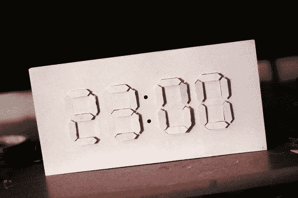

# 一个精致的纸质计时器和一把伺服电机

> 原文：<https://hackaday.com/2013/08/12/an-elegant-timepiece-from-paper-and-a-fistful-of-servos/>

在[这座由【Jacky Mok】](http://www.instructables.com/id/DigitalAnalog-Clock-Arduino-PaperCraft/)制作的纸工艺数字/模拟时钟中，一个个区段从纯粹的白色表面升起，显示出时间。

总部位于纽约的设计师[Alvin Aronson]负责最初的设计，名为[“D/A Clock”，](http://www.alvinaronson.com/D-A-Clock)，是他在 RISD 大学上学时用[Corian](http://www.dupont.com/products-and-services/construction-materials/surface-design-materials/brands/corian-solid-surfaces.html)代替纸张制作的。【阿伦森】的设计相比之下也是海量。它宽一米，高半米。在没有 3D 打印机或激光切割机的情况下，[Jacky]反而缩小了他的解释范围，并依赖卡片纸作为主要的构造材料。他在 papercraft 排版方面的经验导致了一个设计，任何一个拥有 Exacto 刀和一点耐心的人都会发现这个设计是可以处理的。然而[Jacky]忽略了 Exacto 选项，他用我们今年早些时候[看到的工具来切割他的作品:](http://hackaday.com/2013/03/11/pcb-stencils-for-200/)剪影肖像[。](http://www.silhouetteamerica.com/shop/silhouette-portrait)

时钟的电子设备包括一个 Arduino Uno、一个伺服电机控制器、28 个伺服电机和一个处理计时的 [RTC](http://learn.adafruit.com/ds1307-real-time-clock-breakout-board-kit/what-is-an-rtc) 分线板。每个伺服系统通过在一个小的中空铝棒中向前或向后滑动一个回形针来驱动自己的部分。尽管我们仍在等待 papercraft 制作完成的视频，但你可以在休息后观看 Aronson 的原始时钟视频，看看是什么激发了[Jacky 的]设计。

需要另一个时钟来羡慕？上个月由[ebrithil] 建造的[使用 22 个伺服系统来单独旋转这些部分。如果你更喜欢你的时钟亮起来，](http://hackaday.com/2013/07/03/twenty-two-servos-and-an-awesome-clock/ "Twenty two servos and an awesome clock")[【亚伦】的 o-scope 改造](http://hackaday.com/2013/07/01/turning-grandpas-o-scope-into-a-clock/)已经覆盖了你。

[https://www.youtube.com/embed/C9tW6FIX8oQ?version=3&rel=1&showsearch=0&showinfo=1&iv_load_policy=1&fs=1&hl=en-US&autohide=2&wmode=transparent](https://www.youtube.com/embed/C9tW6FIX8oQ?version=3&rel=1&showsearch=0&showinfo=1&iv_load_policy=1&fs=1&hl=en-US&autohide=2&wmode=transparent)