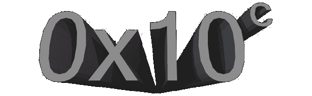

# 0x10c 成为社区开发的游戏

> 原文：<https://hackaday.com/2013/08/12/0x10c-becomes-a-community-devloped-game/>

这是正式的。《《我的世界》》[的创作者[Notch]证实，他已经搁置了 0x10c](http://www.reddit.com/r/0x10c/comments/1k30lw/looks_like_there_is_no_0x10c_at_least_not_from/)的计划，这是一款基于太空的积木建造和探索 MMO，以汇编编程为核心游戏组件。

自从 0x10c 宣布以来的一年多时间里，一大批程序员通过[编写仿真器](http://www.dcpu-ide.com/)甚至在 AVR 上仿真这个只作为设计文件[存在的 CPU，从而获得了游戏中虚构的 CPU——DCPU。不用说，有很多非常熟练的程序员希望这个游戏存在。现在，看起来这个社区正在稳步推进这个项目。](http://hackaday.com/2012/07/25/emulating-the-dcpu-on-an-avr/)

这确实是社区的一项大工程。不仅目前的计划是建立一个开放的世界，程序生成，基于空间的 MMO，看起来这些新的开发者也将从头开始编写自己的引擎。如果这是一项商业努力，它将需要数百万美元和许多年才能得到一个粗略的 alpha 版本，而 0x10c 社区正在免费做这项工作。

如果你有 C++、OpenGL 和 3D 游戏编程的经验，官方注册线程是在 0x10c 子编辑上的[。即使你不是程序员，只有建模、写作的经验，你的经验也会被*大大*赞赏。](http://www.reddit.com/r/0x10c/comments/1k590t/alright_we_decided_our_plan_of_action_so_lets/)