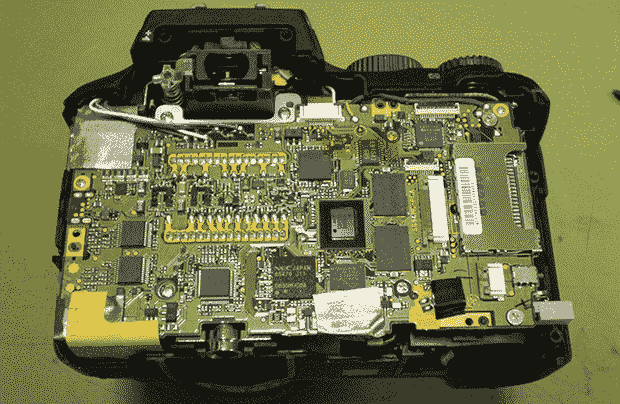

# 在 DSLR 中更换传感器

> 原文：<https://hackaday.com/2013/08/12/swapping-the-sensor-in-a-dslr/>

为了拍摄彩色图像，现代数码相机有一种叫做拜耳图案的东西——红色、绿色和蓝色的小滤镜，每个像素一种颜色——如果你只拍摄黑白照片，分辨率会大大降低。[Lasse]是一名天体摄影师，并不真正需要彩色照片，所以他决定用单色 CCD 代替相机中的彩色传感器。

大多数数码单反相机在奇怪的表面贴装封装上有 CCD 传感器，或者把所有东西都放在柔性印刷电路板上。[Lasse]的 Olympus E-500 配备了一个陶瓷 DIP 上的 800 万像素 CCD，如果有合适的工具和一点点机械鼓励，实际上很容易移除。

在安装了一个新的单色 CCD 后，[Lasse]的相机中有了一个更灵敏的传感器，处理相机中的原始文件使他的天文摄影有了很大的改进。

这并不是[Lasse]第一次冒险拆开数码单反相机进行天体摄影。早些时候，他用逻辑分析仪揭开了四分之三镜头格式的秘密，使他的奥林巴斯相机成为一个观察天空的绝佳工具。