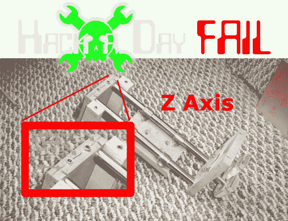

# 本周失败:一个自举数控工厂的愚蠢行为

> 原文：<https://hackaday.com/2013/08/15/fail-of-the-week-the-follies-of-a-bootstrapped-cnc-mill/>

任何从零开始建造自己的数控机床的人都会告诉你，这不是在公园散步。见鬼，即使是市售的(但是业余爱好定价的)3D 打印机也不容易可靠运行。这是一个关于【布莱恩·阿莫斯】[如何一次又一次](http://twilightrobotics.com/cnc/cncnot1)建造数控工厂失败的故事。但是，嘿，这“一遍又一遍”的部分是伟大的黑客。他不仅记录了那些不起作用的东西，还展示了他试图用来克服每一次困难的技巧。

我们认为最有趣的部分在他的第二篇文章中，但是从第一篇开始(这是一篇快速阅读的文章)来了解这个项目的背景。真正的问题始于一个常见的问题:与切割头的轴线相比，床身严重不平。解决方法是使用一个牺牲床，铣出匹配表面的工具。这暴露了下一个问题，即 Z 轴错位。一些在整个支撑结构中的让步意味着溢出和反冲的问题。甚至还有一个非常有创意的螺旋切割耦合器，以帮助解决丝杠和电机之间的对齐问题。

建立一个工厂的好处是你可以用它来加工更精确的替换零件。当你在一个似乎行不通的项目中辛苦工作的时候，就不断地告诉自己吧！

我们已经在寻找下周的失败帖子主题。写下你过去的失败，并[给我们发送一个故事的链接](mailto:tips@hackaday.com?Subject=[Fail of the Week])，帮助保持乐趣。