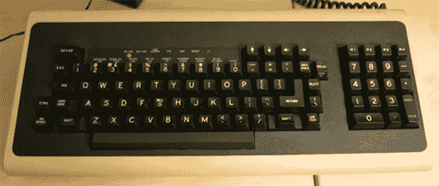

# 用于旧 VT100 键盘的 USB 适配器

> 原文：<https://hackaday.com/2013/08/13/usb-adapter-for-an-old-vt100-keyboard/>

啊，VT100，第一个由微处理器控制的哑终端。这个 70 年代末的古老怪兽与你在它问世五年后发现的终端非常不同——键盘通过 TRS 1/4 英寸插孔连接——这个终端的电子和代码设计有点奇怪。[Seth]能够胜任将这种机械键盘作为标准 USB 设备工作的挑战，[所以他创造了自己的 USB 适配器](http://www.loomcom.com/blog/category/retrocomputing/retrochallenge/retrochallenge2013/)。

在四分之一英寸的 USB 适配器上，[Seth]包括一个 HD 6402 UART 来与键盘对话，以及一个 Teensy dev 板和一些从 DEC 工程师那里偷来的电路[。键盘和终端之间的协议有点奇怪——首先终端在状态字中设置一个位，然后键盘依次扫描所有的键行和列，然后告诉终端它完成了。是的，这给了 VT100 完整的 n 键翻转，但与比它年轻几岁的 IBM 型键盘相比，这只是*怪异的*。](http://www.loomcom.com/blog/2013/07/07/more-hardware-less-software/)

[Seth]最终完成了他的电路，并将其连接到一个性能板上。一切都正常工作，尽管做了一些按键重新映射，以保持这个键盘适配器对 Mac 和 Windows 电脑有用。这是一个很棒的工具包，我们对老 DEC 工程师的任何见解在任何情况下都是一个很棒的读物。

下面是维迪阿斯。

[https://www.youtube.com/embed/QW_uu-B1kbg?version=3&rel=1&showsearch=0&showinfo=1&iv_load_policy=1&fs=1&hl=en-US&autohide=2&wmode=transparent](https://www.youtube.com/embed/QW_uu-B1kbg?version=3&rel=1&showsearch=0&showinfo=1&iv_load_policy=1&fs=1&hl=en-US&autohide=2&wmode=transparent) [https://www.youtube.com/embed/i03rmPtuJZ4?version=3&rel=1&showsearch=0&showinfo=1&iv_load_policy=1&fs=1&hl=en-US&autohide=2&wmode=transparent](https://www.youtube.com/embed/i03rmPtuJZ4?version=3&rel=1&showsearch=0&showinfo=1&iv_load_policy=1&fs=1&hl=en-US&autohide=2&wmode=transparent)