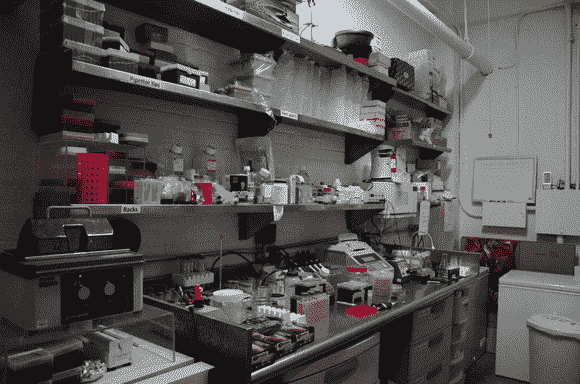

# 你的黑客空间需要一个生物实验室；灵感来了

> 原文：<https://hackaday.com/2013/08/15/your-hackerspace-needs-a-biology-lab-heres-the-inspiration/>

当你想到黑客空间时，你会想到什么？对我们来说，首先是电子，然后是机械加工相关的东西(3D 打印，数控铣削)，然后是焊接，木工，汽车机械，我们可以继续下去。但是生物黑客并不在这个名单上。总部位于纽约的 Genspace 是一个强有力的案例,说明我们为什么应该增加一个生物实验室作为可行的黑客空间选项。

除了收集工具和有技能的成员，帮助世界上疯狂的科学家走出地下室，走向光明之外，黑客空间是什么？几乎每个黑客空间都教授对公众开放的课程。这基本上是一个非营利组织的要求，但也是由使知识开放和可用的美德所驱动的。提供生物主题课程是帮助我们的年轻学生走向科学职业生涯的一个不可思议的结合。

副总裁兼联合创始人[Daniel Grushkin]的灵感来自于一个为期一学期的项目，即破解有机体的大学生。他想尝试一下，但需要资源方面的帮助。他召集了其他几个对此感兴趣的人，在纽约电阻公司的鼓励下，他们在布鲁克林建立了 Genspace。该组织将安全视为头等大事。每个新成员都了解该空间使用的生物安全 1 级准则。对于不太复杂的实验，他们甚至使用自己制作的工具，比如类似于[这个](http://hackaday.com/2013/07/27/make-your-own-fume-extracting-glove-box/)的手套箱。