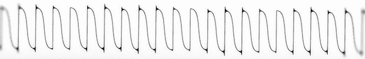

# 把一个小小的 Linux 机器变成合成器

> 原文：<https://hackaday.com/2013/08/16/turning-a-tiny-linux-box-into-a-synthesizer/>

尽管树莓派、BeagleBone 和其他低功耗 Linux 主板可以做很多很酷的事情，但有一件事我们还没怎么见过:用软件合成器创作音乐。是的，软合成器已经存在很长时间了，但是为这些 ARM 板编译它们是我们没有见过的事情(更不用说 Linux 音频系统了)。幸运的是，[Paul]和[Trev]已经编写了一个教程，使用 Csound(Linux 的主要音频编程语言)在这些小型 Linux 板上制作合成器。

[Paul]和[Trev]已经组装了一些 Csound 乐器，包括一个受范吉利斯启发的合成器、一个 Lorenz Strange Attractor FM 合成器、一个鼓机和一个经典的单声道合成器。所有这些乐器都可以在 Raspi 或 BeagleBone 上演奏，我们确信，随着越来越多的音乐家转向这些小型 Linux 板，我们将看到这个伟大的工具在创作乐器方面的更多应用。