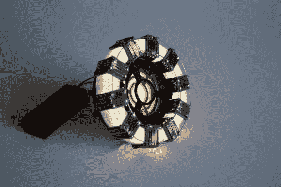

# 3D 打印电弧反应器复制品

> 原文：<https://hackaday.com/2013/08/18/3d-printed-arc-reactor-replica/>

[詹姆斯]只是不停地启动完美的电弧反应堆复制品的想法。这一次大约在[左右，他用 3D 打印机制作了大部分零件](http://xrobots.co.uk/arc2/)。他的文章涵盖了构建的基础，但他也利用这个机会制作了一些关于使用 Autodesk 123D 设计零件的教程视频。

这无疑是对他上一个道具的改进，那个道具是用一元店的零件做的。在设计组件时，他试图尽可能真实地再现电影的原始设计，同时牢记使用家用 3D 打印机的局限性；他把它们印在了 Lolzbot AO-101 上。

下面的视频让您很好地了解了使用 123D 建模零件的感觉。与 Blender 3D 之类的工具相比，该工具集非常简单。但是[詹姆斯]使用它们的方式使得组件变得相当复杂。第二个视频包括一些正在打印的零件的镜头，以及为外观添加缠绕导线和发光二极管的组装过程。

[https://www.youtube.com/embed/bsVWXGaNQ8g?version=3&rel=1&showsearch=0&showinfo=1&iv_load_policy=1&fs=1&hl=en-US&autohide=2&wmode=transparent](https://www.youtube.com/embed/bsVWXGaNQ8g?version=3&rel=1&showsearch=0&showinfo=1&iv_load_policy=1&fs=1&hl=en-US&autohide=2&wmode=transparent)

[https://www.youtube.com/embed/ClYe_BIlMcw?version=3&rel=1&showsearch=0&showinfo=1&iv_load_policy=1&fs=1&hl=en-US&autohide=2&wmode=transparent](https://www.youtube.com/embed/ClYe_BIlMcw?version=3&rel=1&showsearch=0&showinfo=1&iv_load_policy=1&fs=1&hl=en-US&autohide=2&wmode=transparent)