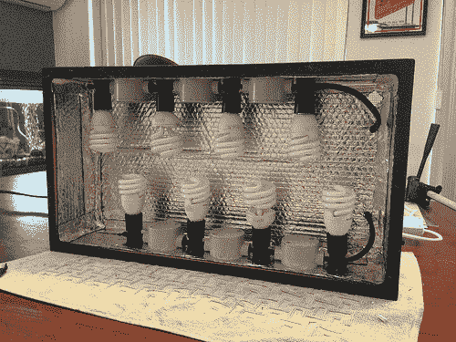

# 紧凑型荧光生长灯

> 原文：<https://hackaday.com/2013/08/19/compact-fluorescent-grow-light/>

对于我们在澳大利亚的朋友来说，春天就要来了。考虑到这一点，[x2Jiggy] [制造了这种紧凑型荧光生长灯](http://x2jiggy.com/blog/2013/8/9/compact-fluorescent-grow-light.html)来帮助他的花园开始播种。他使用了容易找到的材料，多个灯泡意味着你可以混合和搭配它们的颜色温暖度，以便获得最适合植物生长的光波长。

他开始用中密度纤维板制作盒子。当你把车停在炎热的停车场时，它大部分都衬有一个反射器，可以放进你的挡风玻璃里。他用他称之为防水胶带的东西封住了反射器的接缝。这是一种橡胶类型的材料，用作窗户周围的软防水板。

灯泡插座来自一串旧的聚会灯。布线通过塑料接线盒进行，以保持安装符合规范。每个节能灯消耗 20 瓦，总耗电量为 160 瓦。再加上 DIY 水培帐篷，你一年到头都能吃到新鲜的绿色蔬菜。

[https://www.youtube.com/embed/8eFpTvzV3yY?version=3&rel=1&showsearch=0&showinfo=1&iv_load_policy=1&fs=1&hl=en-US&autohide=2&wmode=transparent](https://www.youtube.com/embed/8eFpTvzV3yY?version=3&rel=1&showsearch=0&showinfo=1&iv_load_policy=1&fs=1&hl=en-US&autohide=2&wmode=transparent)