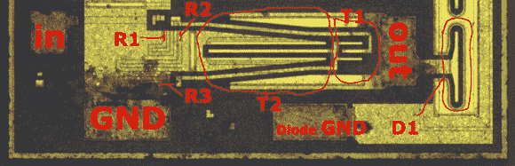

# 对 ULN2003 晶体管阵列的芯片进行逆向工程

> 原文：<https://hackaday.com/2013/08/16/reverse-engineering-the-die-of-a-uln2003-transistor-array/>

我们对无盖芯片并不陌生。这一次不仅仅是展示和讲述，因为一个 ULN2003 芯片的一个晶体管被逆向工程。

上面的照片只是去掉塑料外壳后芯片图片的一部分。称之为逆向工程可能有点夸张。它更像是一个教程，教你如何获取功能原理图，并弄清楚芯片照片上的每个元件是如何放置的。数据手册通常包括这些原理图，以便工程师了解硬件的性能。但是知道芯片上的电阻或晶体管是什么样子完全是另一回事。

问题是你不能只看像上面这样的二维图像。这些半导体元件是三维制造的。这篇文章使用高分辨率照片和参考图说明了 N 型和 P 型材料在晶体管上的位置。

如果你想拍摄自己的芯片，有几种方法可以在家里打开它们的盖子。