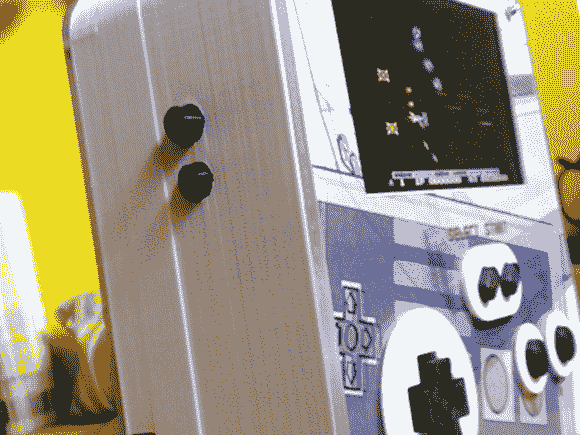

# NESPo:另一款 3D 打印便携式 NES

> 原文：<https://hackaday.com/2013/08/19/nespo-another-3d-printed-portable-nes/>

拿起你最喜欢的弹夹，猛烈地吹到底，因为[戴夫·努内斯]正带着他的 [3D 打印便携式 NES](http://davenunez.wordpress.com/2013/08/16/building-the-nespo/) 送我们踏上怀旧之旅。他走了典型的路线，在芯片上切割任天堂(NOAC)复古机器，而不是牺牲一个真正的 NES，并选择镍氢电池而不是锂电池(这不是一个坏主意；它们*可以* [起火](http://www.youtube.com/watch?v=YCWdnjLqVWw)如果你充电不正确)。然而，电池寿命是可以忍受的:2.5 到 3 小时。

所有的组件都装在一个定制的 3D 打印 PLA 外壳中，[戴夫]好心地在 thingiverse 上分享了这个外壳。他还决定 3D 打印每个按钮及其边框/外壳，然后通过切割密封正面和背面的丙烯酸板来完成。作为最后的润色，[Dave]在丙烯酸下面放入一些定制艺术，并在角落里安装一个印刷的 LED 铭牌。

我们以前在 Hackaday 看过[Dave]的作品，当时他制作了一款适用于所有游戏机的街机控制器。